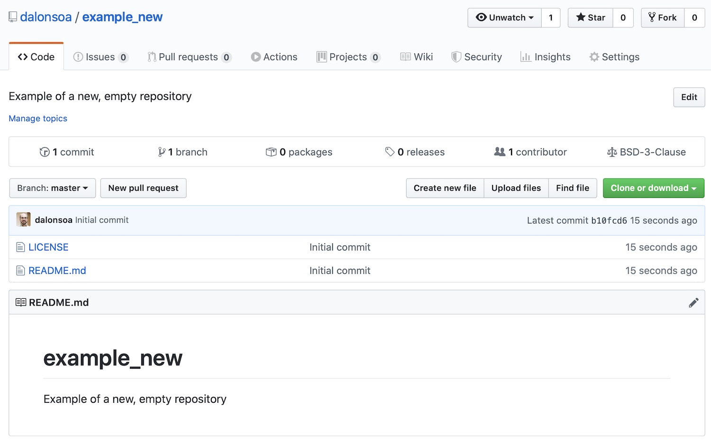

## Collaborating: what you need to know?

Often, you will need to share your code with others, either with just another
person in the same office or anyone, anywhere in the world. Repository hosting
services let you do precisely that, keeping all the advantages of VCS and
adding on top tools to ease the collaborative development of the code:

- Managing different people working on different features.
- Keeping track of the changes introduced in the code and by whom.
- Opening, reviewing, discussing and merging "pull requests".
- Opening "issues" to report bugs, request features or discuss different aspects
  of the code.

## GitHub: Why GitHub?

There are several widely used repository hosting services using Git, such as
[GitLab](https://about.gitlab.com) or
[Bitbucket](https://bitbucket.org/product). In this course we will use
[GitHub](https://github.com) because:

- It is very easy to use and setup.
- It is, arguably, the most used hosting service of them all.
- Imperial has a GitHub Organisation any Imperial staff or student can join.
- You should have already created an account on GitHub according to the [setup
  instructions](../setup).

### Private vs public repositories

Depending of who you want to give access to your repository, there are two
broad types of repositories: **private** and **public**. This choice, the first
one you will need to make, is not written in stone and you can set a repo
private initially and making it public later on.

When you are part of an organization account, there are more options to
control the visibility of a repository.

#### Private repositories

- Only you and the GitHub users you choose can have access to the repository.
- The repository is not listed in the GitHub directory neither it is
  discoverable by Google and other search engines.
- Ideal for testing, for projects with a view on commercialization, preliminary
  work on future open projects or for school/Msc/PhD projects not meant to be
  public.
- Free accounts (except if part of an Organisation account) have several
  limitations on the features that a private repository has (eg. fewer
  collaborative features, no GitHub pages, etc.).

#### Public repositories

- Anyone can see the repository, clone it and fork it (how it is then used
 depends on the license; see below).
- You keep control on who will be able to contribute to the repository.
- The choice for open source projects and to share your work to a wider
  potential user base.

> ## Open Source Projects
>
> There is a growing recognition that reproducibility and open source practices
> in scientific software development are closely interrelated. It is
> increasingly expected that publications are accompanied by the analysis code
> and raw data used to create them. As a budding researcher one of the best ways
> to improve the impact of your work is to make it as easy to reproduce as
> possible.
>
> Read more:
> * [Open Science Massively Open Online Course](https://opensciencemooc.eu/about/)
> * [The Turing Way][turing-way]
> * [The OpenScience Project](http://openscience.org/about-openscience/)
{: .callout}

[turing-way]: https://www.turing.ac.uk/research/research-projects/turing-way-handbook-reproducible-data-science#introduction

## Things to include in your project

There are a few files that should get used to always include in the root
directory of your repository:

### README.md

- Written in [Markdown](https://guides.github.com/features/mastering-markdown),
  it is the front page of your repo.
- Should describe in lay terms (or not) the purpose of the software, intended
  audience, etc.
- Should include simplified installation instructions or a link to more
  detailed instructions described elsewhere.
- Often includes [badges](https://github.com/badges/shields), providing quick
  information on the status of the documentation, the builds, the software
  version, license, etc.
- For inspiration see [Solcore](https://github.com/qpv-research-group/solcore5)
- For further guidance see [Make a README](https://www.makeareadme.com/) or this
  [template](https://gist.github.com/PurpleBooth/109311bb0361f32d87a2).

### Licence

- Important in any repository, essential in a public one.
- Describes how people are allowed to use (and re-use) the information in your
  repository.
- Do use a standard licence file to avoid headaches and legal issues later on.
- If your repository is part of an Organisation, make sure this organisation
  allows that licence. Ultimately, it will be them the ones having to fight
  any legal battles!!
- Licence choice is also something you should consider discussing with your
  supervisor if relevant, they may have strong views.

See [GitHub Help: Adding a license to a repository][adding-licence]

[adding-licence]: https://help.github.com/en/github/building-a-strong-community/adding-a-license-to-a-repository

> ## Licence for Imperial College London software
>
> Imperial College's preferred licence is the permissive BSD 2- or 3-clause. You
> can check the details at [Imperial website: Open Source Software
> Licences][licence-guidance]. The guidance on this site is primarily intended
> for members of staff however it is correct for graduate students with the
> exception that ([subject to certain conditions][ip-guidance]) you are entitled
> to hold the copyright. This site also tells you who you should contact in case
> you want a different licence model for your work e.g. commercial.
{: .callout}

[licence-guidance]: https://www.imperial.ac.uk/enterprise/staff/industry-partnerships-and-commercialisation/commercialisation/intellectual-property-guidance/open-source-software-licences/
[ip-guidance]: https://www.imperial.ac.uk/research-and-innovation/about-imperial-research/research-integrity/ip/

> ## Open Source software licences
>
> There is a huge range of different licences, ranging from fully permissive
> to very restrictive. A couple of websites with more information on the
> topic (including how to licence things that are not software) are:
>
> - [Open Source Initiative](http://opensource.org/)
> - [https://choosealicense.com](https://choosealicense.com)
{: .callout}

### Installation process/instructions

- If short, they can be part of the README file above.
- Otherwise, they should have their own INSTALLATION.md file and, definitely,
  be included in any documentation you write for the software.
- Should be complete and specific for any operating system and platform you
  want to support.
- If you know your software will not work in, let's say, Windows, say so!!

### CITATION.txt

- Indicates how your software should be cited by anyone using it.
- Often includes the citation in plan text and as a Bibtex entry.
- Point to this file from the README, so people do not miss it.

> ## Digital Object Identifiers (DOI)
>
> If you are serious about what you are doing and want people to really cite
> your work properly - and get recognition for it - consider providing your
> repo with a digital object identifier (DOI). You can get one from:
>
> - [Zenodo](https://zenodo.org)
> - [Figshare](https://figshare.com)
{: .callout}

### CONTRIBUTING.md

- Are guidelines explaining how people should contribute to your project.
- Could include steps for creating good issues or pull requests.
- Often, also have links to external documentation, mailing lists, or a code of
 conduct and community and behavioral expectations.

See [GitHub Help: Setting guidelines for repository contributors][contributors].

[contributors]: https://help.github.com/en/github/building-a-strong-community/setting-guidelines-for-repository-contributors

> ## Creating a repository
>
> Now you have all the information you need to create a new repository in
> GitHub. Just follow this steps:
>
> - Once logged in to GitHub, press the `+` symbol in the top right, and choose
>   `new repository` from the dropdown menu.
> - Give your repository the name `example`.
> - Add a short description for your project.
> - You are going to create a **Public** repository, so select that option.
> - Click on **Initialize this repository with a README**. This will create an
>   empty README file in the root directly that you can edit later on.
> - Select a licence for your repository. Which one is up to you, but make sure
>   you have read what they entail before (Tip: there is a little "i" next to
>   the dropdown list with some help on this. In case of doubt, choose BSD 3
>   -clause.
>
> > ## Solution
> > Your repository is now ready and you should see something similar to this:
> > 
> > It tells you there is only 1 commit, 1 branch and 1 contributor, the type
> > of licence you have chosen and also that there are two files: LICENSE and
> > README.md, which is also rendered immediately below.
> {: .solution}
> To make this complete, let's add some contributing guidelines:
>
> - Go to **Insights** in the upper right corner of the repository.
> - And then click on **Community** on the left hand side.
> - The screen now shows how the project compares with the recommended
>   community standards. Is not bad, but could be better.
> - Click on **Add** in the *Contributing* line. In the new screen you can
>   write your contributing guidelines. **Tip**: *No one* writes this from
>   scratch.
>
> Have a look at some [Examples of contributing
> guidelines][contributing-examples] and copy/paste those parts relevant for
> your project.
> - Once you are done, click on **Commit new file** and the changes will be
>   confirmed. Now you should see a CONTRIBUTING.md file in the root directory.
{: .challenge}

[contributing-examples]: https://help.github.com/en/github/building-a-strong-community/setting-guidelines-for-repository-contributors#examples-of-contribution-guidelines


